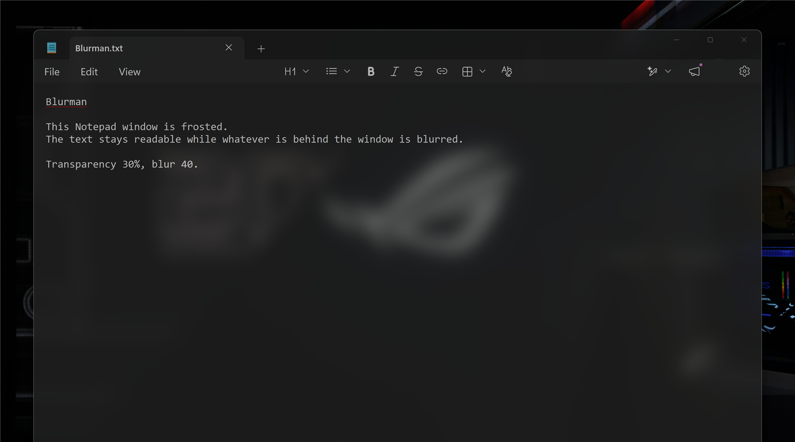
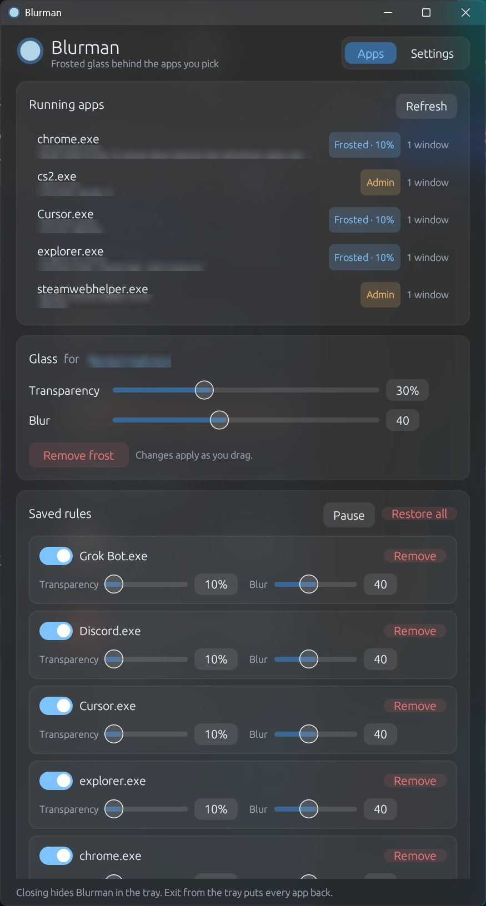

# Blurman

Frosted glass behind the Windows apps you pick. Chrome, Edge, Electron apps, Notepad, Explorer, and anything else with a normal window.



<p align="center"></p>

## Features

- Pick any running app, set **transparency** and **blur**, and press **Frost it**. Sliders apply live.
- Rules are saved per app and come back on every new window of that app.
- **Solid text** (experimental, per app) turns only the app's background to glass and keeps text and images fully solid. See [Solid text](#solid-text).
- **Pause** puts every app back without deleting rules. **Restore all** deletes them.
- **Start with Windows** runs Blurman quietly in the tray at sign-in. **Keep in tray on close** does the same for normal launches, so apps stay frosted while the window is closed.
- Glass follows the app as you move, resize, minimize, or switch virtual desktops.
- If Blurman crashes or is killed, the next start (or `blurman clear --all`) puts every app back.

## Requirements

- Windows 11 for adjustable blur. Windows 10 works with system acrylic, where the blur slider sets how milky the glass is.
- [Rust](https://rustup.rs) stable, with the MSVC toolchain (`stable-x86_64-pc-windows-msvc`, the rustup default on Windows).
- Visual Studio Build Tools with the **Desktop development with C++** workload, which provides the MSVC linker and Windows SDK. rustup offers to install it if it is missing.

## Build

```powershell
git clone https://github.com/N3N-X/blurman.git
cd blurman
cargo build --release
```

The app is `target\release\blurman.exe`. It is a single file with no installer. Copy it anywhere and run it. If you use **Start with Windows**, turn it on again after moving the exe, or just open Blurman once from the new location and it updates the startup entry itself.

Run the tests with `cargo test`.

## Use

Run `blurman.exe` to open the window. Running it again brings the window forward, or opens it if Blurman is in the tray.

There is also a small command line:

```powershell
blurman list                                        # visible apps Blurman can frost
blurman apply chrome.exe --transparency 30 --blur 40  # save a rule; opens Blurman if needed
blurman apply chrome.exe --solid-text               # same, with solid text
blurman clear chrome.exe                            # remove one rule
blurman clear --all                                 # remove every rule and put every app back
```

Transparency ranges from 10 to 70 percent, and blur from 1 to 100.

Rules live in `%APPDATA%\Blurman\rules.json` and settings in `settings.json` next to it. **Start with Windows** adds a `Blurman` entry under `HKCU\Software\Microsoft\Windows\CurrentVersion\Run`.

## How it works

Windows cannot blur only the background of another app's window, so Blurman does two things. It fades the whole app with layered-window alpha, and it places a glass window of its own directly behind the app. The glass uses Windows composition to Gaussian-blur whatever is behind it, so what shows through the faded app is frosted instead of sharp. Because the fade applies to the whole window, text fades a little too. Transparency is capped at 70 percent so it stays readable.

Apps running as administrator can only be frosted when Blurman runs as administrator too. They show an **Admin** badge in the app list.

### Solid text

With **Solid text** on, Blurman hides the real app (it stays at alpha 1, so it still gets every click and key) and shows a live copy of it on the glass instead. The copy comes from Windows Graphics Capture. A small GPU shader finds the app's background color and makes only that color see-through, so text, icons, and images stay at full strength.

It costs a few percent of one CPU thread and about 40 MB of GPU memory per app. The copy trails the real app by about one frame. Protected video (DRM) shows as black, as in any screen capture. Apps with a busy or gradient background get less glass, because only a single flat background color is keyed out.

While a fullscreen game or presentation is in front, solid text falls back to the normal fade so it never competes with the game for the GPU. **Keep solid text during fullscreen games** in Settings turns that off.

If Blurman is killed while an app is hidden, a small watchdog process (`blurman watchdog`) puts the app back within a second.
